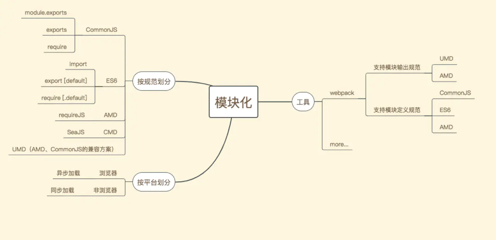
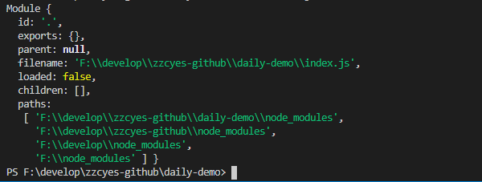
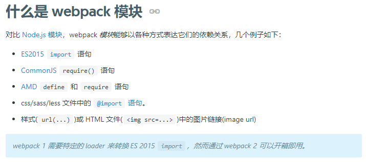

# 前端模块化



## 平台

| 平台 | 规范 | 特性 |
| ---- |----|----|
| 浏览器 | AMD、CMD	| 存在网络瓶颈，使用异步加载 |
| 非浏览器 | CommonJS |	直接操作 IO，同步加载 |

## 特性

|特性 |	规范|
|--|--|
|同步加载	|CommonJS|
|异步加载	|AMD、CMD|


## 规范


### AMD和CMD

|规范 | 约束条件 | 代表作 |
| ---- | ---- | ---- |
| AMD | 依赖前置 | requirejs |
| CMD | 就近依赖 | seajs |


AMD、CMD 提供了封装模块的方法，实现语法上相近，甚至于 requirejs 在后期也默默支持了 CMD 的写法。我们用一个例子，来讲清楚这两个规范之间最大的差异：**依赖前置**和**就近依赖**。

- AMD

```js
// hello.js
define(function() {
    console.log('hello init');
    return {
        getMessage: function() {
            return 'hello';
        }
    };
});
// world.js
define(function() {
    console.log('world init');
});

// main
define(['./hello.js', './world.js'], function(hello) {
    return {
        sayHello: function() {
            console.log(hello.getMessage());
        }
    };
});

// 输出
// hello init
// world init
```

- CMD

```js
// hello.js
define(function(require, exports) {
    console.log('hello init');
    exports.getMessage = function() {
        return 'hello';
    };
});

// world.js
define(function(require, exports) {
    console.log('world init');
    exports.getMessage = function() {
        return 'world';
    };
});

// main
define(function(require) {
    var message;
    if (true) {
        message = require('./hello').getMessage();
    } else {
        message = require('./world').getMessage();
    }
});

// 输出
// hello init
```

结论： CMD 的输出结果中，没有打印"world init"。

**需要注意的是，CMD 没有打印"world init"并是不 world.js 文件没有加载。AMD 与 CMD 都是在页面初始化时加载完成所有模块，唯一的区别就是就近依赖是当模块被 require 时才会触发执行**。

### CommonJS

CommonJS 定义了，一个文件就是一个模块。在 node.js 的实现中，也给每个文件赋予了一个 module 对象，这个对象包括了描述当前模块的所有信息，我们尝试打印 module 对象。



在CommonJS中，模块使用对象表示的。

### ES6 module

AMD、CMD、CommonJS 规范，是为了基于规范实现的模块化，并非 JavaScript 语法上的支持。 

| 保留字	| CommonJS |ES6|
| -- | -- | -- |
| require | 支持| 支持 |
| export/import | 不支持 | 支持 |
| exports/module.exports | 支持 | 不支持 |

CommonJS与ES6 module差异：

| 规范 | 模块输出 |	加载方式 |
| -- | -- | -- |
| CommonJS | 值拷贝	| 对象 |
| ES6 | 引用（符号链接） | 静态解析 |

值拷贝和引用：
```js
// CommonJS
let a = 1;
exports.a = a;
exports.add = () => {
    a++;
};

const { add, a } = require('./a.js');
add();
console.log(a); // 1
```

```js
// ES6
export const a = 1;
export const add = () => {
    a++;
};

import { a, add } from './a.js';
add();
console.log(a); // 2 
```

静态解析(使用require字样，静态解析的能力丢失):

ES6 的模块并不是一个对象，而只是代码集合。也就是说，ES6 不需要和 CommonJS 一样，需要把整个文件加载进去，形成一个对象之后，才能知道自己有什么，而是在编写代码的过程中，代码是什么，它就是什么。

### UMD 

```
UMD = AMD + CommonJS
```

## 工具

webpack支持 CommonJS、AMD、ES6 module等模声明方式。



同时，webpack也可以将其识别的模块打包成UMD、AMD等规范的模块重新输出。

## 资源

- [WEB 前端模块化都有什么？](https://juejin.cn/post/6844903717947310093#heading-2)
