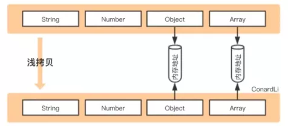
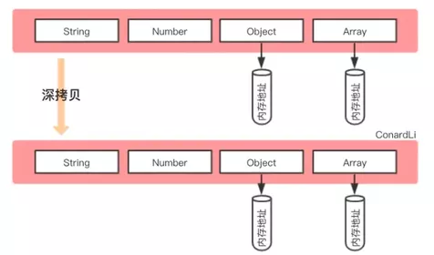
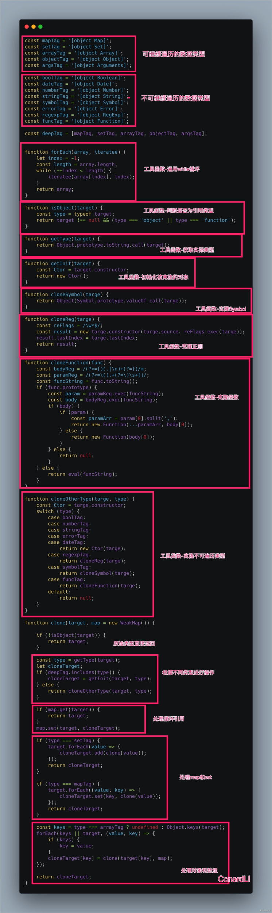

# 浅拷贝、深拷贝

## 数据类型
- **基本数据类型**

String、Number、Boolean、Null、Undefined、Symbol。基本数据类型是直接存储在栈中的数据。

- **引用数据类型**

Array、Object。引用数据类型存储的是该对象在栈中引用，真实的数据存储在内存中。
## 浅拷贝
创建一个新对象，这个对象有着原始对象属性值的一份精确拷贝。如果属性是**基本类型**，拷贝的就是**基本类型的值。**如果属性是**引用类型**，拷贝的就是**内存地址** ，所以如果其中一个对象改变了这个地址，就会影响到另一个对象。




### 基础版
```javascript
function clone(target) {
    let cloneTarget = {};
    for (const key in target) {
        cloneTarget[key] = target[key];
    }
    return cloneTarget;
};
```

## 深拷贝
将一个对象从内存中完整的拷贝一份出来,从堆内存中开辟一个新的区域存放新对象,且修改新对象不会影响原对象。



### 实现

### 简易版

我们想要深拷贝，为了省事常用如下方法：

```javascript
function clone(value){
	return JSON.parse(JSON.stringify(value));
}
```

写法简单，也可以应对大多数应用场景，但是有比较多缺陷。

- 不支持函数
- 不支持undefined（**支持null**）
- 不支持循环引用，比如 `a = {name: 'a'}`; `a.self = a`; `a2 = JSON.parse(JSON.stringify(a))`
- 不支持Date，会变成 ISO8601 格式的字符串
- 不支持正则表达式
- 不支持Symbol
- NaN会转为null类型
```javascript
var obj = {
  a:null,
  b:NaN,
  c:undefined,
  d:'sss',
  e:Symbol('E'),
  f:function(){return 'func'},
  g:[],
  h:/a-z/g
};
var cobj  = clone(obj);
cobj;

// {
//  	a: null
//		b: null
//		d: "sss"
//		g: []
//		h: {}
//	}
```

### 循环引用
```javascript
function clone(target, map = new Map()) {
    if (typeof target === 'object') {
        let cloneTarget = Array.isArray(target) ? [] : {};
        if (map.get(target)) {
            return map.get(target);
        }
        map.set(target, cloneTarget);
        for (const key in target) {
            cloneTarget[key] = clone(target[key], map);
        }
        return cloneTarget;
    } else {
        return target;
    }
};
```

### 可继续遍历的类型

object、array、map、set等都可继续遍历。
辅助函数：

```javascript
 function isObject (obj){
  return obj !== null && typeof obj === 'object'
}
function toRawType (value) {
  return Object.prototype.toString.call(value).slice(8, -1)
}
function forEach(array, iteratee) {
    let index = -1;
    const length = array.length;
    while (++index < length) {
        iteratee(array[index], index);
    }
    return array;
}
function keepCtor(target) {
    const Ctor = target.constructor;
    return new Ctor();
}
```
```javascript
function clone(target, map = new WeakMap()) {
    // 克隆原始类型
    if (!isObject(target)) {
        return target;
    }
    // 初始化
    const type = toRawType(target);
    let cloneTarget;
    if (['Map','Set','Array','Object'].includes(type)) {
        cloneTarget = keepCtor(target, type);
    }
    // 防止循环引用
    if (map.get(target)) {
        return map.get(target);
    }
    map.set(target, cloneTarget);
    // 克隆set
    if (type === 'Map') {
        target.forEach(value => {
            cloneTarget.add(clone(value,map));
        });
        return cloneTarget;
    }
    // 克隆map
    if (type === 'Set') {
        target.forEach((value, key) => {
            cloneTarget.set(key, clone(value,map));
        });
        return cloneTarget;
    }
    // 克隆对象和数组
    const keys = type === 'Array' ? undefined : Object.keys(target);
    forEach(keys || target, (value, key) => {
        if (keys) {
            key = value;
        }
        cloneTarget[key] = clone(target[key], map);
    });
    return cloneTarget;
}
```

### 完整版



## 资源

- [浪里行舟-浅拷贝与深拷贝](https://juejin.cn/post/6844904197595332622)
- [ConardLi-如何写出一个惊艳面试官的深拷贝](http://www.conardli.top/blog/article/JS%E8%BF%9B%E9%98%B6/%E5%A6%82%E4%BD%95%E5%86%99%E5%87%BA%E4%B8%80%E4%B8%AA%E6%83%8A%E8%89%B3%E9%9D%A2%E8%AF%95%E5%AE%98%E7%9A%84%E6%B7%B1%E6%8B%B7%E8%B4%9D.html#%E5%9F%BA%E7%A1%80%E7%89%88%E6%9C%AC)
- [一次搞定前端“四大手写”](https://zhuanlan.zhihu.com/p/160315811)
