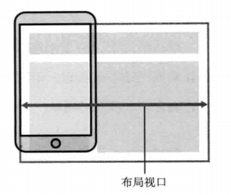
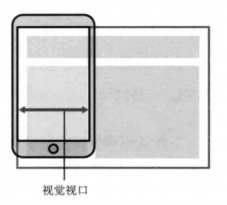

# 移动端适配

## 概念

### 屏幕分辨率
屏幕分辨率是指纵横向上的像素点数，单位是px。

### 设备像素（Device Pixels）
设备像素，也称为物理像素。指设备能控制显示的最小物理单位，意指显示器上一个个的点。设备的物理像素的数量都是固定的。

### CSS像素（CSS Pixel）
web编程中的概念，属于设备独立像素中的一种，独立于设备，属于逻辑上衡量像素的单位。为web开发者创造的，在css（和javascript）中使用的一个抽象的层。

### 设备独立像素（Device Independent Pixels，`DIP`）
设备独立像素，又称密度无关像素。是一种物理测量单位，基于计算机控制的坐标系统和抽象像素（虚拟像素），由底层系统的程序使用，转换为物理像素的应用。

### 设备像素比（Device Pixel Ratio，`DPR`）
设备像素比其实指的是`window.devicePixelRatio`, 一个设备的物理像素与逻辑像素之比。代表系统转化时一个CSS像素占有多少个物理像素。
```javascript
设备像素比(DPR) = 设备像素(物理像素) / 设备独立像素(DIP)
```

### 像素密度（Pix Per Inch，PPI）
像素密度，所表示的是每英寸所拥有的像素数量。因此PPI数值越高，即代表显示屏能够以越高的密度显示图像。当然，显示的密度越高，拟真度就越高

### 移动端视口

#### 布局视口（Layout Viewport）
一般移动设备的浏览器都默认设置了一个 viewport 元标签，定义一个虚拟的布局视口（layout viewport），用于解决早期的页面在手机上显示的问题。iOS, Android 基本都将这个视口分辨率设置为 980px，所以 PC 上的网页基本能在手机上呈现，只不过元素看上去很小，一般默认可以通过手动缩放网页。



获取布局视口的宽度、高度：
```javascript
document.documentElement.clientWidth;
document.documentElement.clientHeight;
```

#### 视觉视口（Visual Viewport）
视觉视口是用户当前看到的区域，用户可以通过缩放操作视觉视口，同时不会影响布局视口。



视觉视口和缩放比例的关系为：

```javascript
当前缩放值 = 理想视口宽度  / 视觉视口宽度
```

显示设置布局视口：
```javascript
<meta name="viewport" content="width=400">
```

布局视口使视口与移动端浏览器屏幕宽度完全独立开。CSS 布局将会根据它来进行计算，并被它约束。

#### 理想视口（Ideal Viewport）
布局视口的默认宽度并不是一个理想的宽度，于是 Apple 和其他浏览器厂商引入了理想视口的概念，它对设备而言是最理想的布局视口尺寸。显示在理想视口中的网站具有最理想的宽度，用户无需进行缩放。

理想视口的值其实就是屏幕分辨率的值，它对应的像素叫做**设备独立像素（Device Independent Pixels, **`**DIP**`**）**。DIP 和设备的物理像素无关，一个 DIP在任意像素密度的设备屏幕上都占据相同的空间。如果用户没有进行缩放，那么一个 CSS 像素就等于一个 DIP。

用下面的方法可以使布局视口与理想视口的宽度一致：

```
<meta name="viewport" content="width=device-width">
```

实际上，这就是响应式布局的基础。

### 位图像素
一个位图像素是栅格图像(如：png, jpg, gif等)最小的数据单元。每一个位图像素都包含着一些自身的显示信息(如：显示位置，颜色值，透明度等)。
理论上，1个位图像素对应于1个物理像素，图片才能得到完美清晰的展示。当遇上对应的位图像素与物理像素不统一的时候。

1. 位图像素 < 物理像素。 1个位图像素对应于多个物理像素，由于单个位图像素不可以再进一步分割，所以只能就近取色，从而导致图片模糊。（具体取决于设备系统的图像算法，并不是简单的切割图片）（图片拉伸）
1. 位图像素 > 物理像素。1个物理像素对应多个位图像素，所以它的取色也只能通过一定的算法(显示结果就是一张位图像素只有原图像素总数四分之一的图片)，肉眼看上去虽然图片不会模糊，但是会觉得图片缺少一些锐利度，或者是有点色差(但还是可以接受的)（图片挤压）

## rem

### JS计算
```javascript
!(function (doc, win) {
    let docEl = doc.documentElement,
        resizeEvt = 'orientationchange' in window ? 'orientationchange' : 'resize',
        recalc = function () {
            let clientWidth = docEl.clientWidth;
            if (!clientWidth) return;
            win.rem = 100 * (clientWidth / 750);
            docEl.style.fontSize = win.rem + 'px';
        };

    if (!doc.addEventListener) return;
    win.addEventListener(resizeEvt, recalc, false);
    doc.addEventListener('DOMContentLoaded', recalc, false);
})(document, window);
```

#### 公式
```javascript
win.rem = 100*(clientWidth/750)
```

#### CSS
例如：一个按钮的尺寸在宽为750的设计稿上为，宽180px，高48px。

那么以iphone6的宽度为基础准算，实际宽度为375先不考虑乘以100，则`win.rem = clientWidth/750 = 375/750 = 0.5;` 也就意味着宽度转为rem显示`180/0.5 = 360rem`，高度为`48/96=96rem`。

```css
.button{
		/*width: 180px;
		height: 48px;*/
  	width: 360rem;
		height: 96rem;
}
```

这样rem显示的数值就比较大，为了方便计算，我们把clientWidth/750的比例乘以100，得到50，则button的高度样式如下：

```css
.button{
		/*width: 180px;
		height: 48px;*/
  	width: 3.6rem;
		height: 0.96rem;
}
```

#### API

- orientationchange

`orientationchange`事件在设备的纵横方向改变时触发。

- DOMContentLoaded

当初始的 **HTML **文档被完全加载和解析完成之后，**`DOMContentLoaded` **事件被触发，而无需等待样式表、图像和子框架的完全加载。

- resize

`onresize`属性可以用来获取或设置当前窗口的resize事件的事件处理函数

## Q&A

### Q：!(function(){})()
立即调用的匿名函数又被称作**立即调用的函数表达式**（IIFE，Immediately Invoked Function
Expression）。它类似于函数声明，但由于被包含在括号中，所以会被解释为函数表达式。紧跟在第一组
括号后面的第二组括号会立即调用前面的函数表达式。
```
!function(){}()
(function(){})
(function(){}())
```

### Q：1px问题

## 资源

- [移动端适配-rem(新)](https://www.cnblogs.com/formercoding/p/13019629.html)
- [CSS像素、物理像素、逻辑像素、设备像素比、PPI、Viewport ](https://github.com/jawil/blog/issues/21)
- [设备像素、设备独立像素、CSS像素、分辨率、PPI、devicePixelRatio 的区别](https://zhuanlan.zhihu.com/p/68563760)
- [设备像素比devicePixelRatio简单介绍](https://www.zhangxinxu.top/wordpress/2012/08/window-devicepixelratio/)
- [浅谈移动端中的视口（viewport）](https://www.cnblogs.com/yuduxyz/p/9745962.html)
